 

<h3><code>sharmaa-abhi@github ~ $ whoami</code></h3>

<table>
<tr>
<td width="42%" valign="top"><picture>
  <source media="(prefers-color-scheme: light)" srcset="https://www.gitskins.com/api/section/portrait?username=sharmaa-abhi&theme=github-dark&style=terminal&mode=light" />
  
</picture></td>
<td width="58%" valign="top"><picture>
  <source media="(prefers-color-scheme: light)" srcset="https://www.gitskins.com/api/section/wordmark?username=sharmaa-abhi&theme=github-dark&style=terminal&label=Abhishek+Sharma&mode=light" />
  
</picture></td>
</tr>
</table>

<b>Frontend or full-stack engineer</b>

<a href="https://github.com/sharmaa-abhi">GitHub</a>

<h3><code>sharmaa-abhi@github ~ $ cat tech-stack.txt</code></h3>

<h3><code>sharmaa-abhi@github ~ $ ./contributions.sh</code></h3>

<picture>
  <source media="(prefers-color-scheme: light)" srcset="https://www.gitskins.com/api/section/heatmap?username=sharmaa-abhi&theme=github-dark&style=terminal&mode=light" />
  
</picture>

<picture>
  <source media="(prefers-color-scheme: dark)" srcset="https://raw.githubusercontent.com/tobiasmeyhoefer/tobiasmeyhoefer/output/github-snake-dark.svg" />
  <source media="(prefers-color-scheme: light)" srcset="https://raw.githubusercontent.com/tobiasmeyhoefer/tobiasmeyhoefer/output/github-snake.svg" />
  
</picture>

Abhishek Sharma  · Profile generated with <a href="https://www.gitskins.com/readme-generator">GitSkins</a>

