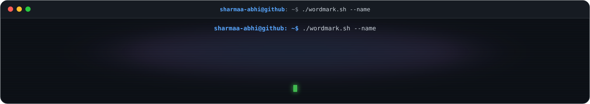
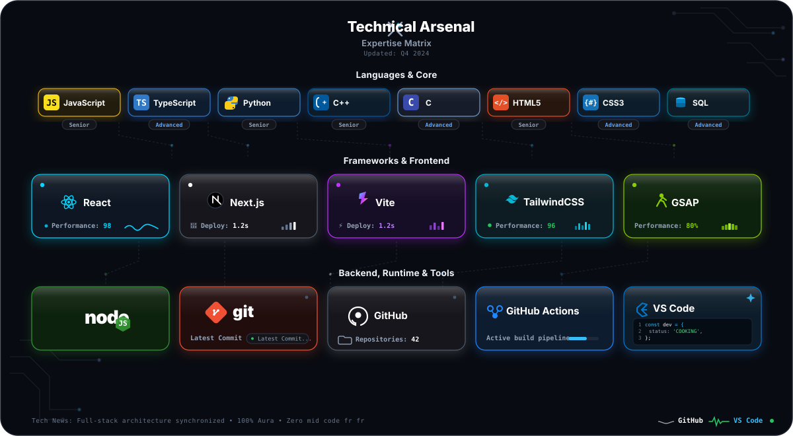

<div align="center">

  <!-- DYNAMIC TYPING HERO -->
  

  <br />

  <!-- TERMINAL BRAND BANNER -->
  

  <br /><br />

  <p align="center">
    <strong>🚀 Full-Stack & Frontend Engineer</strong> dedicated to building high-performance web applications,<br />
    responsive interfaces, and interactive software experiences.
  </p>

  <p align="center">
    <a href="https://github.com/sharmaa-abhi?tab=repositories">
      
    </a>
    <a href="mailto:sharmaa24434@gmail.com">
      
    </a>
  </p>

</div>

<br />
<hr />
<br />

<!-- ABOUT & OVERVIEW -->
### ⚡ About Me

```bash
sharmaa-abhi@portfolio:~$ cat overview.json
{
  "name": "Abhishek Sharma",
  "role": "Frontend & Full-Stack Engineer",
  "interests": ["Scalable Web Architecture", "Interactive Graphics", "Open Source Tools"],
  "currently_learning": ["Advanced Distributed Systems", "High-Performance WebGL"],
  "motto": "Build fast, iterate with precision, ship with confidence."
}
```

<br />
<hr />
<br />

<!-- AUTOMATED CONTRIBUTION SHOWCASE -->
<div align="center">

  <h3>🎮 Contribution Space Shooter</h3>
  <p><em>Automated dynamic arcade simulation rendered from live GitHub contribution telemetry.</em></p>

  <br />

  

</div>

<br />
<hr />
<br />

<!-- TECH STACK BENTO MATRIX -->
<div align="center">

  

  <br />

  <!-- DYNAMIC SKILLICONS DOCK -->
  <p align="center">
    <a href="https://skillicons.dev">
      
    </a>
  </p>

</div>

<br />
<hr />
<br />

<!-- GITHUB ACTIVITY & METRICS -->
<div align="center">

  <h3>📊 Activity & Contribution Telemetry</h3>

  <br />

  <!-- Snake Animation -->
  <picture>
    <source media="(prefers-color-scheme: dark)" srcset="https://raw.githubusercontent.com/sharmaa-abhi/sharmaa-abhi/output/github-contribution-grid-snake-dark.svg" />
    <source media="(prefers-color-scheme: light)" srcset="https://raw.githubusercontent.com/sharmaa-abhi/sharmaa-abhi/output/github-contribution-grid-snake.svg" />
    
  </picture>

  <br /><br />

  <!-- Streak Stats Card -->
  

  <br /><br />

  <!-- GitHub Statistics Card -->
  <picture>
    <source media="(prefers-color-scheme: light)" srcset="https://www.gitskins.com/api/section/stats?username=sharmaa-abhi&theme=github-dark&style=terminal&mode=light" />
    
  </picture>

</div>

<br />
<hr />
<br />

<!-- CONNECT WITH ME -->
<div align="center">

  <h3>🤝 Connect & Collaborate</h3>
  <p>Feel free to reach out for project collaborations, engineering discussions, or innovative opportunities.</p>

  <br />

  <p>
    <a href="mailto:sharmaa24434@gmail.com">
      
    </a>
    <a href="https://www.linkedin.com/in/abhishek-sharma-88876b389/" target="_blank">
      
    </a>
  </p>

</div>
